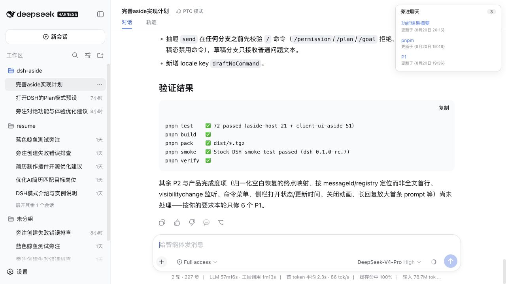
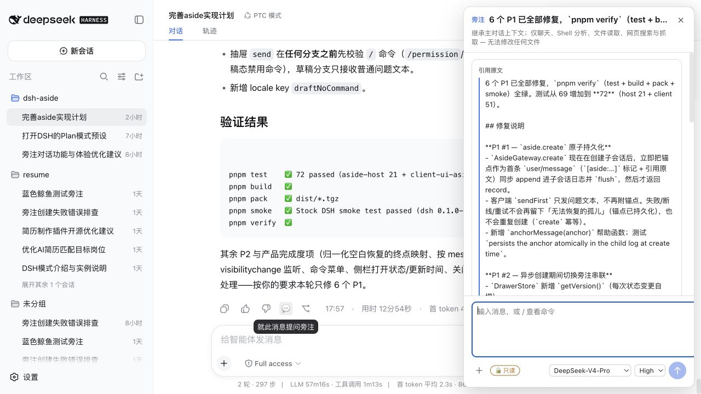
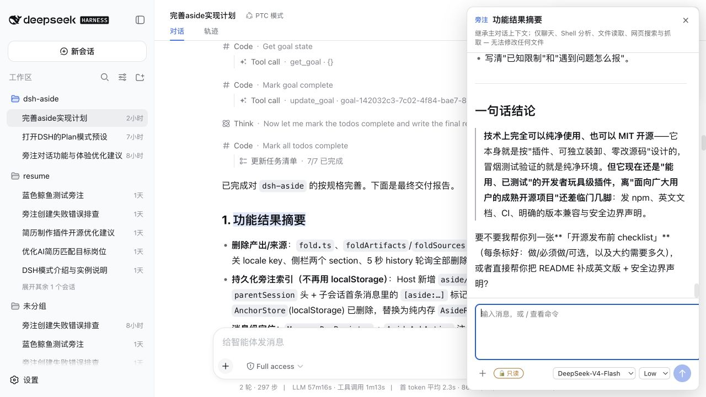

<div align="center">

# dsh-aside

Persistent, read-only side conversations anchored to exact prose in [DeepSeek Harness](https://github.com/deepseek-ai/deepseek-harness).

[简体中文](README.md) · [Install](#install) · [Usage](#usage) · [Uninstall](#uninstall)

[](https://github.com/ywzhang1031/dsh-aside/actions/workflows/ci.yml)
[](https://github.com/ywzhang1031/dsh-aside/stargazers)
[](https://www.npmjs.com/package/dsh-aside)
[](https://www.npmjs.com/package/dsh-aside)
[](LICENSE)
[](https://github.com/deepseek-ai/deepseek-harness)

</div>

## Why

Long answers often contain one concept, formula, or piece of background knowledge worth exploring. Continuing in the main conversation can derail its original goal; starting another conversation loses the surrounding context. Temporary side chats help, but they are difficult to revisit when the original question is no longer visible.

An **aside** binds a follow-up to a specific span in the main conversation, forks the completed parent context into an independent read-only session, and keeps that relationship in DSH's durable session log. It behaves like a margin note: it does not interrupt the main line of work, and it still explains what you did not understand when you return later.

## Preview



| Draft anchored to source prose | Persistent multi-turn aside |
| --- | --- |
|  |  |

## Features

- Anchor a follow-up to selected assistant prose or a message-level 💬 action.
- Fork completed parent context without writing side questions back into the main thread.
- Persist anchors and aside relationships in DSH session logs — no `localStorage` index.
- Keep child sessions inside the parent conversation's right rail instead of the left session list.
- Choose model, reasoning effort, and whitelisted commands in a familiar composer.
- Enforce `sandbox/mode: read-only` and `approval/policy: never` for every aside.

## Install

With DeepSeek Harness `0.1.0-rc.7` installed, setup is one command:

```sh
dsh plugin --profile web add dsh-aside
```

Restart `dsh web` afterward. If DSH is not installed yet:

```sh
npm install -g @deepseek-ai/dsh@0.1.0-rc.7 pnpm@11.7.0
```

The public bundle installs and composes the internal Host and Web UI packages automatically. Users do not need to clone or build this repository.

## Usage

1. Select prose in a completed assistant reply and click **就此提问**, or use the message's 💬 action.
2. Review the quoted source, optionally choose a model and reasoning effort, then send. Closing an unsent draft creates nothing.
3. Continue the read-only side conversation in the drawer.
4. Reopen it from the highlighted prose, message action, or **Aside chats** rail. Older parent history is loaded automatically when needed to locate the anchor.

## Uninstall

Use the official DSH command:

```sh
dsh plugin --profile web remove dsh-aside
```

For repository development, the cross-platform helper also supports earlier two-package local installs:

```sh
pnpm plugin:uninstall -- --profile web
```

Restart `dsh web` afterward. Uninstalling removes the profile bundle but does **not** delete existing main or aside session logs.

## Honest boundaries

- Read-only covers filesystem mutation, not network access. Asides can still use read-only shell, file-reading, and web-fetch capabilities.
- Stock `tool-fs` still exposes `write` / `edit`, but the read-only sandbox and never-approve policy reject them.
- Exact highlighting is best-effort and degrades to message-level positioning when rendered prose cannot be restored precisely.
- Child-session navigation hiding uses DSH's public archive projection; logs and Workspace ownership remain intact.
- Only DSH `0.1.0-rc.7` is currently verified.

## Development

```sh
pnpm install
pnpm test       # 94 tests
pnpm build
pnpm run pack
pnpm smoke      # isolated install, cold boot, and uninstall
pnpm verify
```

See [IMPLEMENTATION_PLAN.md](IMPLEMENTATION_PLAN.md) for architecture details. Issues and pull requests are welcome; claims should remain grounded in verifiable behavior.

## License

[MIT](LICENSE) © [ywzhang1031](https://github.com/ywzhang1031)
